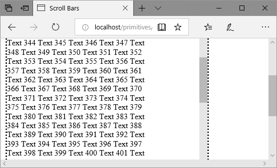
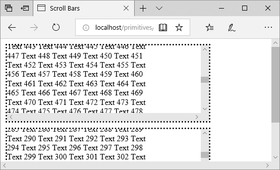
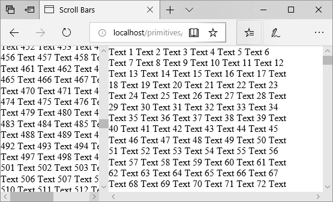

# Diagram Sizing
## Responsive Design
Like any other Data Visualization component it combines scalable and non-scalable graphics elements. For example we would like to show 10'000 labels but it is just physically impossible to fit them, because their total square size is multiple times bigger than available screen space. At the same time we cannot scale all of them down to points, since they become simply unreadable. Try to disable "fit to page" for large hierarchy demo, the resulting diagram is going to be so big that its visualization makes no sense, this rendering mode is useful only for PDF generation for reporting purposes only. If we speak about BI applications designed for data analysis then we need to show nodes only in the scope of current user focus of interest, so diagramming applications should be dynamic and adopt to user data and requirements. Another argument in favour of diagramming applications having auto layout is the fact that in large organizations where we have over 500 people the rate of changes is so high that any organizational structure becomes obsolete as soon as we make its hard copy. So we use various strategies to show as mush data as possible to the user within available screen space, so control needs to be notified about its placeholder size changes in order to trigger rendering cycle. 

## Diagram placeholder sizing is applications responsibility
Component occupies all available space inside parent `div`, so if application changes size of `div` containing diagram component it triggers component state change and following rendering cycle. Component uses [`resize-observer-polyfill`](https://www.npmjs.com/package/resize-observer-polyfill) to handle diagram size change.

## Component Sizing with CSS @Media
The main point of CSS @Media based control sizing is to keep diagram component size less than screen size. We want to have diagram to be as large as possible, but we need to avoid situation when user has to scroll diagram and page srollbars altogether in order to see diagram content. The first image shows unusable scroll bars.



Having scroll bars enabled for components is fine if they fit into the page view port. So we can place diagram component and stack it verticaly with other components on the page. The following image shows 2 components having scrollable content, both of them are usable, since user can scroll them into the current view port and work with their content scrollbars individually.



The "classic" and the most popular approach for desktop applications is to fit page and diagram 100%. In that case you have to design your web site appropriatly.



The following sample control hight is sized by CSS @Media rules to be within current page view port size. Try to resize your browser window in order to see how it works. The diagraming component has minimum vertical size set to hardcoded 250px.

See [CSS @Media](https://developer.mozilla.org/en-US/docs/Web/CSS/@media) for more reference

[React](../src/Samples/PageSizeDiagram.js)

## Auto Size Diagram in Article
Another diagram integration scenario is diagram placement inside article, so component needs to auto expand its size in order to accommodate all nodes of diagram without minimization or trancation. Set `pageFitMode` to `primitives.common.PageFitMode.AutoSize` and component will size itself to show all nodes of diagram. 

Use following options to constrain component auto size:

* `autoSizeMinimum` - it limits minimal size of diagram, so if it is empty then you are going to see empty `div` of this size.
* `autoSizeMaximum` - does not allow to grow component beyond this size. Set maximum size to some value if you need to avoid humongous diagram on your page.

for example in order to set widget minimal size: 

```JavaScript
<OrgDiagram centerOnCursor={true} config={{
  autoSizeMinimum: new primitives.common.Size(800, 600),
  autoSizeMaximum: new primitives.common.Size(1024, 768)
  // other properties
}} />
```

[React](../src/Samples/AutoSize.js)
